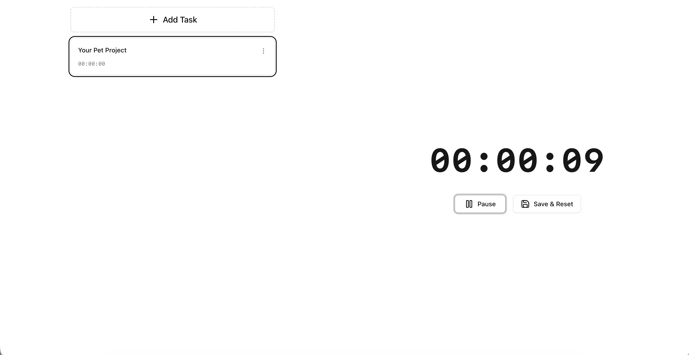
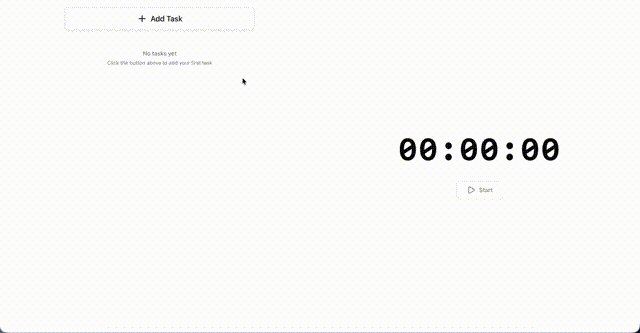

# Work Time Tracker

A minimal, browser-based time tracking app for managing tasks and logging work sessions.

## Demo





## Features

- Create, edit, and delete tasks
- Start/pause/save timer for selected task
- View time history grouped by date
- Dark/light theme support
- All data stored locally in your browser

## Tech Stack

React 19 • TypeScript • Vite • Tailwind CSS • Radix UI

## Getting Started

```bash
npm install
npm run dev
```

## Live Demo

[time-tracker.riabkov.com](https://time-tracker.riabkov.com)
